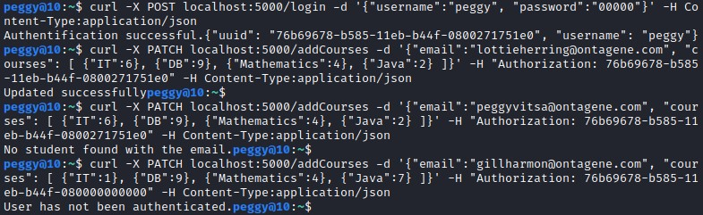
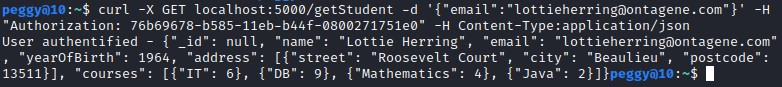

<h1>Ergasia_1_E18025_Vitsa_Panagiota</h1>

<h2>Introduction</h2>
<p>This project is made possible with a mongodb database and flask. The execution of this application took place in linux, kali. It is written in python 3. The main goal was to implement various entrypoints, such as get, post, delete and patch.</p>

<h3>Question 1</h3>
<p>On that question, we create a user.</p>

 ````python
    if users.find({"username":data["username"]}).count()==0: #Αν το username δεν υπάρχει στο collection users (.count()==0) τότε τον εισάγω
        user = {"username":data['username'], "password":data['password']}
        users.insert_one(user) #Εισαγωγή του χρήστη στο collection
        return Response(data['username'] + " was added to the MongoDB", status=200, mimetype='application/json') # Μήνυμα επιτυχίας και εμφάνιση επιτυχούς status
    
    # Διαφορετικά, αν υπάρχει ήδη κάποιος χρήστης με αυτό το username
    else:
        # Μήνυμα λάθους (Υπάρχει ήδη κάποιος χρήστης με αυτό το username)
        return Response("A user with the given email already exists", status=400, mimetype='application/json') # Εμφάνιση status αποτυχίας
````

<p>First of all, we check if the user already exists inside the user collection (with the .find() function). If the user doesn't exist (.count()==0), we proceed by adding them as a new user and print a corresponding message. If the user already exists, then we just print a message.</p>
<p>The command that we used in order to test the question is:</p>

````bash
curl -X POST localhost:5000/createUser -d '{"username":"peggy", "password":"00000"}' -H Content-Type:application/json
````


<h3>Question 2</h3>
<p>Here, we establish a user session with the user login.</p>

 ````python
     if users.find_one( {"$and": [ {"username":data['username']}, {"password":data['password']}] } ): # Αν υπάρχει χρήστης με ίδιο συνδυασμό username και password
        user_uuid = create_session(data['username']) # Δημιουργία του session του χρήστη
        res = {"uuid": user_uuid, "username": data['username']} # Εκχώρηση δεδομένων σε μεταβλητή res για εμφάνιση στον χρήστη, με τη βοήθεια του json.dumps()
        return Response("Authentification successful." + json.dumps(res), mimetype='application/json', status=200) # Μήνυμα επιτυχίας και εμφάνιση επιτυχούς status

    # Διαφορετικά, αν η αυθεντικοποίηση είναι ανεπιτυχής.
    else:
        # Μήνυμα λάθους (Λάθος username ή password)
        return Response("Wrong username or password.", status=400, mimetype='application/json') # Εμφάνιση status αποτυχίας
 ````
 
 <p>If a user already exists, then the function create_session() is called in order to return a unique user id (uuid) for the user. Each time the user logs in, the uuid will be different.<br/>Then, we proceed by printing the uuid, <i>which the user will need to have for future questions</i>, and their username, successfully authenticating them. </p>
<p>Here's the command in order to get the successful message:</p>

````bash
curl -X POST localhost:5000/login -d '{"username":"peggy", "password":"00000"}' -H Content-Type:application/json
````

<p>By changing the username in the command, and therefore entering a non-existent match we get as a result an error message, as we should.</p>


<h3>Question 3</h3>
<p>Here, we can print all the information of a student that exists in the students collection.</p>

 ````python
 uuid = request.headers.get('Authorization') # Εισαγωγή uuid από τον χρήστη
    if is_session_valid(uuid) : # Αν το uuid είναι valid, τότε εκτέλεση ερωτήματος
        student = students.find_one({'email':data["email"]}) # Εύρεση μαθητή με το εισαγόμενο email
        if student != None: # Αν υπάρχει ο μαθητής
            # Η παρακάτω εντολές χρησιμοποιούνται μόνο στη περίπτωση επιτυχούς αναζήτησης φοιτητών (δηλ. υπάρχει φοιτητής με αυτό το email).
            student['_id'] = None
            return Response("User authentified - " + json.dumps(student), status=200, mimetype='application/json') # Μήνυμα επιτυχίας, στοιχείων μαθητή και εμφάνιση επιτυχούς status
        else: # Αν δεν υπάρχει ο μαθητής
            return Response("Student doesn't exist.") # Μήνυμα ότι ο μαθητής δεν υπάρχει
    else:
        return Response("User has not been authenticated.", status=401, mimetype='application/json') # Ο χρήστης δεν έχει ταυτοποιηθεί
````

<p>First of all, it's a necessity for us as a user to login. The reason why, is because we need the uuid to authenticate ourselves, in order to be able to execute the command of the question. The command is:</p>

````bash
curl -X GET localhost:5000/getStudent -d '{"email":"pearliechan@ontagene.com"}' -H "Authorization: 2027bdfa-b346-11eb-80b6-0800271751e0" -H Content-Type:application/json
````

<p>The Authorization string is the uuid of the user. But when changing the email to one that doesn't exist in the students collection, it prints the corresponding message.</p>


<p>If the session with the uuid is valid, then find the student with the given email. If it exists, then we print their personal information - otherwise, the student doesn't exist.</p>

<h3>Question 4</h3>
<p>On that question, we print all of the students that are 30 years old, who exist in the students collection.</p>

 ````python
 uuid = request.headers.get('Authorization') # Εισαγωγή uuid από τον χρήστη
    if is_session_valid(uuid) : # Αν το uuid είναι valid, τότε εκτέλεση ερωτήματος
        iterable = students.find({"yearOfBirth": 1991}) # Εύρεση μαθητών με ημερομηνία γέννησης το 1991 (30 ετών)
        student_list = [] # Κενή λίστα στην οποία θα περαστούν όσοι είναι 30 ετών
        for student in iterable: # Επανάληψη για κάθε μαθητή που βρήκε
            student['_id'] = None
            student_list.append(student) # Εισαγωγή μαθητή στη λίστα
        if student_list != None: # Αν η λίστα έχει άτομα, εκτύπωση μηνύματος με τη λίστα στον χρήστη
            return Response(json.dumps(student_list), status=200, mimetype='application/json') # Μήνυμα λίστας μαθητών που είναι 30 ετών και εμφάνιση επιτυχούς status
        else: # Αν η λίστα είναι κενή, τότε δεν υπάρχουν 30άριδες
            return Response("There are no students that are 30 year old.") # Μήνυμα ότι δεν υπάρχουν μαθητές που είναι 30 ετών
    else:
        return Response("User has not been authenticated.", status=401, mimetype='application/json') # Ο χρήστης δεν έχει ταυτοποιηθεί
````

<p>Again, we get the user's uuid and if the session is valid then we continue solving the question.<br/>If it's valid, in an iterable we find all the students that are born in the year 1991 (30 years old). Then, we initialize a student_list in order to enter all 30 years old students. With a for loop, we append all the students we found in the iterable in the list. If the list is empty, meaning there aren't any students that are 30 years old, then we just print a relevant message.<br/>If the list has students, then we print all the 30 year old students.</p>
<p>If the session is not valid, then the user has not been authenticated.</p>
<p>Here's the command that executes the specific entrypoint:</p>

````bash
curl -X GET localhost:5000/getStudents/thirties -H "Authorization: 80ae61e4-b501-11eb-b151-0800271751e0" -H Content-Type:application/json
````
<p>We notice that the collection has two 30 year olds: Browning Rasmussen & Bennet Baker.<br/>We also notice that if we enter a wrong uuid then the user is not authenticated.</p>


<h3>Question 5</h3>
<p>On that entrypoint, we print all of the students that are above the age of 30 years old, who exist in the students collection.</p>

 ````python
 uuid = request.headers.get('Authorization') # Εισαγωγή uuid από τον χρήστη
    if is_session_valid(uuid) : # Αν το uuid είναι valid, τότε εκτέλεση ερωτήματος
        iterable = students.find({"yearOfBirth":{'$lte':1991}}) # Εύρεση μαθητών με ημερομηνία γέννησης κάτω του 1991 (30+ ετών)
        student_list = [] # Κενή λίστα στην οποία θα περαστούν όσοι είναι άνω των 30 ετών
        for student in iterable: # Επανάληψη για κάθε μαθητή που βρήκε
            student['_id'] = None
            student_list.append(student) # Εισαγωγή μαθητή στη λίστα
        if student_list != None: # Αν η λίστα έχει άτομα, εκτύπωση μηνύματος με τη λίστα στον χρήστη
            return Response(json.dumps(student_list), status=200, mimetype='application/json') # Μήνυμα λίστας μαθητών που είναι άνω των 30 ετών και εμφάνιση επιτυχούς status
        else:
            return Response("There are no students that are equal or older than 30 year old.") # Μήνυμα ότι δεν υπάρχουν μαθητές που είναι άνω των 30 ετών
    else:
        return Response("User has not been authenticated.", status=401, mimetype='application/json') # Ο χρήστης δεν έχει ταυτοποιηθεί
 ````
 
<p>If the session is valid, then in an iterable we save all of the students we find that are older than 30 years old, meaning that they were born before 1991. In a new student_list we append all of those students.<br/>If the list is empty, then there are indeed no students older than 30 years old. But if the list has students, then we print their information as asked.</p>
<p>On the specific collection, there are plenty of students, as shown below.</p> 
<p>The command for that entrypoint is:</p>

````bash
curl -X GET localhost:5000/getStudents/oldies -H "Authorization: 4b68d984-b505-11eb-b933-0800271751e0" -H Content-Type:application/json
````


<h3>Question 6</h3>
<p>On that entrypoint, we print all of the students that are above the age of 30 years old, who exist in the students collection.</p>

 ````python
 uuid = request.headers.get('Authorization') # Εισαγωγή uuid από τον χρήστη
    if is_session_valid(uuid) : # Αν το uuid είναι valid, τότε εκτέλεση ερωτήματος
        student = students.find_one({"$and":[ {"email":data["email"]}, {"address":{"$ne":None}} ]}) # Εύρεση μαθητή με το δωθέν email και ύπαρξη διεύθυνσης
        if student != None: # Υπάρχει μαθητής
            student = {"name":student["name"], 'street':student["address"][0]["street"], 'postcode':student["address"][0]["postcode"]} # Εισαγωγή πληροφοριών μαθητή για εκτύπωση
            # Η παρακάτω εντολή χρησιμοποιείται μόνο σε περίπτωση επιτυχούς αναζήτησης φοιτητή (υπάρχει ο φοιτητής και έχει δηλωμένη κατοικία).
            return Response(json.dumps(student), status=200, mimetype='application/json') # Μήνυμα εκτύπωσης στοιχείων μαθητή και εμφάνιση επιτυχούς status
        else: # Δεν υπάρχει μαθητής που να έχει και το δωθέν email και εκχωρημένη διεύθυνση
            student = students.find_one({"email":data["email"]}) # Ελέγχω αν υπάρχει το email
            if student == None: # Αν δεν υπάρχει το email, τότε δεν υπάρχει μαθητής
                return Response("There is no student with that email.")
            else: # Αν υπάρχει το email, τότε ο συγκεκριμένος μαθητής δεν έχει περασμένη διεύθυνση
                return Response("The student with the email you entered has no address.")
    else:
        return Response("User has not been authenticated.", status=401, mimetype='application/json') # Ο χρήστης δεν έχει ταυτοποιηθεί
````

<p>If the session is valid, then find one student with the given email (from the user input) that has an address. If we do find a student, then in a students variable enter the name, the street and the postcode only. The way we do the two latter is with the [0] pointer. Since the student is one, then on the zero place it's their information. In order to specify the street and postcode, it's the elements student["address"][0]["street"] & student["address"][0]["postcode"]. Then, that information is printed to the user.</p>
<p>If not found, then we check if the email exists or not, in order to print more accurate messages.</p>

<p>The command that is used to execute that entrypoint is:</p>

````bash
curl -X GET localhost:5000/getStudentAddress -d '{"email":"tessagomez@ontagene.com"}' -H "Authorization: de68a33c-b509-11eb-aa71-0800271751e0" -H Content-Type:application/json
````


<h3>Question 7</h3>
<p>On that entrypoint, we delete a student with a specific email, who belongs in the students collection.</p>

 ````python
 uuid = request.headers.get('Authorization') # Εισαγωγή uuid από τον χρήστη
    if is_session_valid(uuid) : # Αν το uuid είναι valid, τότε εκτέλεση ερωτήματος
        student = students.find_one({"email":data["email"]}) # Εύρεση μαθητή με το δωθέν email
        if student != None: # Αν υπάρχει ο μαθητής, τότε διαγράφεται
            students.delete_one(student) # Διαγραφή
            st_name = student["name"] # Εκχώρηση ονόματος σε μεταβλητή
            msg = st_name + " was deleted." # Δημιουργία msg μηνύματος για εκτύπωση
            return Response(msg, status=200, mimetype='application/json') # Μήνυμα επιτυχούς διαγραφής μαθητή και εμφάνιση επιτυχούς status
        else: # Αν δεν υπάρχει μαθητής, εκτύπωσε αντίστοιχο μήνυμα
            return Response("There is no student with that email.")
    else:
        return Response("User has not been authenticated.", status=401, mimetype='application/json') # Ο χρήστης δεν έχει ταυτοποιηθεί
````

<p>Again, we have to check for the session validity. If it's valid, we proceed by solving the question.</p>
<p>The deletion is based on the email of the student. So the user will give the email, it's gonna be searched in the students collection and if it exists it will delete itself with the function .delete_one(). We also initiate a variable with the student's name, and then put the variable in a new variable called msg.</p>
<p>Variable <i>msg</i> will print a message saying that the student was deleted.</p>
<p>If there isn't a student with that email, or the session is invalid then it will print corresponding messages.</p>
<p>Right below, the command that executes the delete entrypoint is presented.</p>

````bash
curl -X DELETE localhost:5000/deleteStudent -d '{"email":"tessagomez@ontagene.com"}' -H "Authorization: a28c6d06-b510-11eb-8a87-0800271751e0" -H Content-Type:application/json
````


<h3>Question 8</h3>
<p>Here, the user has the ability to add courses to a specific student - based on their email, who belongs in the students collection.</p>

 ````python
 uuid = request.headers.get('Authorization') # Εισαγωγή uuid από τον χρήστη
    if is_session_valid(uuid) : # Αν το uuid είναι valid, τότε εκτέλεση ερωτήματος
        student = students.find_one({"email":data["email"]}) # Εύρεση μαθητή με το δωθέν email
        if student != None: # Αν υπάρχει ο μαθητής, τότε εκχωρούνται τα μαθήματα του στα στοιχεία του
            student = students.update_one({'email':data["email"]}, {'$set': {'courses':data["courses"]}}) # set: εκχώρηση των νέων στοιχείων μαθημάτων-βαθμών
            msg = "Updated successfully" # Μήνυμα επιτυχίας σε μεταβλητή
            return Response(msg, status=200, mimetype='application/json') # Εκτύπωση του προηγούμενου μηνύματος, εμφάνιση επιτυχούς status
        else: # Αν δεν υπάρχει μαθητής, εκτύπωσε αντίστοιχο μήνυμα
            return Response('No student found with the email.', status=500, mimetype='application/json')
    else:
        return Response("User has not been authenticated.", status=401, mimetype='application/json') # Ο χρήστης δεν έχει ταυτοποιηθεί
 ````
 
 <p>Only if the session is valid we can execute the question - otherwise it's gonna print a user unidentification message.<br/>The code searches if the email that the user entered exists in the students collection. If it exists, update the student's information for it to also include the courses with the grades the user entered in the command. Then, print a successful update type of message.<br/>If the email doesn't match someone's in the collection, a message with status 500 is printed.</p>
 <p>Below, the command that successfully updates a student is shown:</p>
 
 ````bash
 curl -X PATCH localhost:5000/addCourses -d '{"email":"lottieherring@ontagene.com", "courses": [ {"IT":6}, {"DB":9}, {"Mathematics":4}, {"Java":2} ]}' -H "Authorization: 76b69678-b585-11eb-b44f-0800271751e0" -H Content-Type:application/json
 ````
 
 
 
 <p>Making sure that the courses really did get into the collection, we check with the help of a previous question, getStudent, to get the student info:</p>
 

<h3>Question 9</h3>
<p>Here, the user has the ability get the passed courses of a specific student - based on their email, who belongs in the students collection.</p>

 ````python
 uuid = request.headers.get('Authorization') # Εισαγωγή uuid από τον χρήστη
    if is_session_valid(uuid) : # Αν το uuid είναι valid, τότε εκτέλεση ερωτήματος
        student = students.find_one({"$and":[ {"email":data["email"]}, {"courses":{"$ne":None}} ]}) # Εύρεση μαθητή που έχει το δωθέν email και έχει εκχωρημένα μαθήματα
        if student != None: # Αν υπάρχει ο μαθητής, τότε εκχωρούνται τα μαθήματα του στα στοιχεία του
            student['_id'] = None
            courses = {'courses':student["courses"]} # Δημιουργία courses για να μπορούν να προσπελαστούν τα μαθήματα ένα-ένα στην επανάληψη
            passed = {} # Δημιουργία κενού dictionary, στο οποίο θα εισαχθούν τα περασμένα μαθήματα του μαθητή
            for course in courses.values(): # Για κάθε μάθημα, επανάληψη
                for item in course:
                    for grade in item:
                        if item.get(grade) >= 5: # Αν ο βαθμός είναι περασμένος, τότε εκχωρείται στο dictionary passed
                            passed[grade] = item.get(grade)
            if len(passed) != 0: # Αν το dictionary περασμένων έχει μαθήματα
                return Response(student["name"] + json.dumps(passed), status=200, mimetype='application/json') # Εκτύπωση επιτυχούς μηνύματος και επιτυχούς status)
            else: # Αν το dictionary περασμένων είναι άδειο
                return Response("The student hasn't passed any courses.")
        else: # Δεν υπάρχει μαθητής που να έχει και το δωθέν email και τα μαθήματα
            student = students.find_one({"email":data["email"]}) # Ελέγχω αν υπάρχει το email
            if student == None: # Αν δεν υπάρχει το email, τότε δεν υπάρχει μαθητής
                return Response("There is no student with that email.")
            else: # Αν υπάρχει το email, τότε ο συγκεκριμένος μαθητής δεν έχει εισάγει μαθήματα
                return Response("The student with the email you entered has no courses.")
    else:
        return Response("User has not been authenticated.", status=401, mimetype='application/json') # Ο χρήστης δεν έχει ταυτοποιηθεί
````

<p>If the session is valid, then a search is performed in order to find one student with the email the user entered, who also has courses and grades in their information. If we find one, then we create an empty dictionary named passed in which the passed courses will be entered. For each course in the courses, we check if the grade is 5 or more. If it is, then the grade enters the dictionary <i>passed</i>.<br/>If the length of the dictionary is zero, then the student has not passed any courses.</p>
<p>If we don't find a student that has both the given email by the user and non-empty courses, we check if there is a student with just that email, in order to get the user more accurate response messages. If the email doesn't exist, then there is no student in the collection.</p>
<p>The command that successfully shows the passed courses of a student is:</p>

````bash
curl -X GET localhost:5000/getPassedCourses -d '{"email":"lottieherring@ontagene.com"}' -H "Authorization: b6923640-b589-11eb-b385-0800271751e0" -H Content-Type:application/json
````


<p>For the sake of checking if a student doesn't have any passed courses, we will update a random student with grades below 5, just to see the correct response message pop up.</p>


